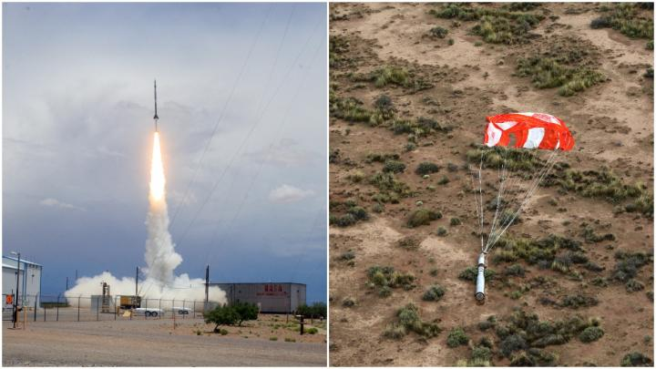

### Rocket EVE

The EVE Rocket program’s objective is to calibrate the EUV Variability Experiment (EVE) instrument on the Solar Dynamics Observaotry (SDO) mission. Built and controlled by LASP, the EVE instrument measures solar extreme ultraviolet (EUV) irradiance, or the energy from the Sun that heats most of Earth’s thermosphere. Sounding rocket under-flight calibration flights are carried out regularly over the SDO mission’s duration to ensure the accuracy of EVE-collected data by measuring any changes to the EVE instrument in space. 

Please check the [Launch Updates](index.md) for the latest information on the Rocket EVE 36.389 launch.