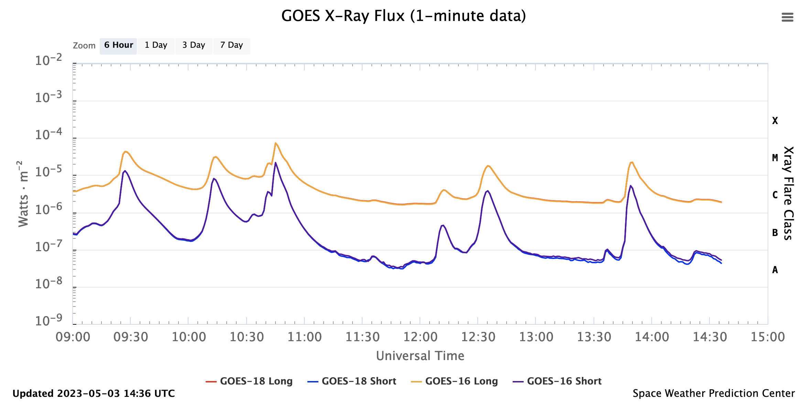

# Launch Updates

Check here for the latest updates on the status of the Rocket EVE 36.389 launch.

### 3 May 2023 - 8:41 AM MDT

MEGS CCD detectors have been cooled down to -50C, and final arming of the rocket motors have started. The Sun is very active today, with already 5 M-class flares this morning. For calibration purposes, we intend to launch when the Sun is not flaring. That is, we may hold the launch by 5-10 minutes if a flare is about to peak at the launch time.

### 2 May 2023

All is a __Go__ for launch on __May 3__.  We have approval from NASA, WSMR, and Navy for launch on May 3 with a window of 18:10-18:40 UT (12:10 PM - 12:40 PM MDT).  The weather forecast is looking good too.

NASA TV will show the launch with the following link active starting at 11:45 AM MDT:
[https://video.ibm.com/channel/nasa-tv-wallops](https://video.ibm.com/channel/nasa-tv-wallops)

### 1 May 2023

The Vertical Tests are completed.

### 28 April 2023

The rocket motors (Terrier and Black Brant) have been mounted to the launch rail.  The experiment vacuum pump cart and payload have also been mounted to the rail. The last big test before launch is the Vertical Test that is scheduled for Monday May 1.

### 26 April 2023 

Horizontal (sequence) tests were completed. We're on schedule for launch on May 3rd.

### 25 April 2023

SDO EVE team has decided to add a 90 degree roll during flight at T+370sec to provide additional validation of the alignments between the EVE instruments and the sun position sensors (LISS, MASS, MEGS-SAM, XRS-SPS, PicoSIM-SPS). The prime solar observations for calibrations are near apogee from T+220sec and T+340sec.

### 24 April 2023

Solar alignment post-vibration checks indicate less than 1 arc-minute shifts (requirement is 3 arc-min).
Payload has its final flight inspections and preparations.

